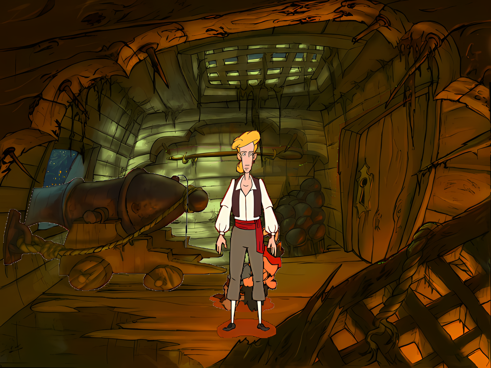

# COMI-HD — Curse of Monkey Island HD Upscale


*Room 9 (Cannon Gallery) with HD textures — 4x upscale*

---

## Overview

COMI-HD is a **ScummVM fork** that renders Curse of Monkey Island (COMI / SCUMM v8) in **4x HD**. It loads external HD textures (backgrounds, costumes, objects, fonts, videos) from an `hd/` directory and scales coordinates at runtime — no original game file patching required.

### Features
- ⚡ **4x HD** (2560×1920) — AI-upscaled textures via RealESRGAN
- 🎭 **25,303 costume frames** — HD characters in full detail
- 🖼️ **81 HD backgrounds** — every room upscaled
- 🎬 **15 HD videos** — AI-upscaled cutscenes (optional)
- 🔧 **No patching** — original game files remain untouched

---

## Quick Start

### 1. Get the Game

You need a **legal copy of "The Curse of Monkey Island"**.

| Source | Link | Price |
|--------|------|:-----:|
| **Steam** | https://store.steampowered.com/app/730820/ | ~€5 |
| **GOG** | https://www.gog.com/en/game/the_curse_of_monkey_island | ~€5, DRM-free |

Copy the game data into the `game/` subdirectory. You need these files:
- `COMI.LA0`, `COMI.LA1`, `COMI.LA2`, `RESOURCE/`

### 2. Get the HD Assets

Download the HD texture packs from the [COMI-HD Release on Archive.org](https://archive.org/details/...) (link pending — assets are being prepared for upload).

Extract the `hd/` directory next to `game/`:
```
your-game-folder/
├── game/          ← your COMI game data
├── hd/            ← HD textures (backgrounds, objects, costumes, fonts)
├── scummvm.exe    ← this fork
├── SDL2.dll       ← Windows only
├── scummvm.ini    ← preconfigured
└── start_comi_hd.bat
```

### 3. Run

**Windows:** Double-click `start_comi_hd.bat`
**Linux:** `./start_comi_hd.sh`

First launch shows the difficulty selection screen. Select a difficulty and the game starts with HD textures.

---

## Downloads

### GitHub Releases
Pre-built binaries are available on the [Releases page](https://github.com/harrytyp/comiupscale/releases).

| Release | Contents |
|---------|----------|
| **Binary releases** (`v*.*.*`) | `scummvm.exe` (Windows binary) + `scummvm` (Linux binary) |
| **Asset releases** (`hd_assets_*`) | HD texture packs (backgrounds, objects, costumes, fonts) — extract into `hd/` |

> **Note:** Windows also needs `SDL2.dll` (with audio support) and config files from [`release/windows/`](release/windows/):
> - `SDL2.dll` — must be built with audio support (see [Building SDL2](#building-sdl2))
> - `scummvm.ini`, `start_comi_hd.bat`, `playback_comi_hd.bat`

### 4K Cutscenes (Optional)
For 4K upscaled cutscenes by **ubertrout** (additional ~6 GB):
📥 https://archive.org/details/COMI_4k
Extract into `hd/videos/`. Without these, cutscenes play in original SD.

---

## Building from Source

### Prerequisites
```bash
sudo apt install build-essential cmake pkg-config curl
```

### Build
```bash
git clone https://github.com/harrytyp/comiupscale.git
cd comiupscale

# Build both Linux + Windows binaries
bash build/build-all.sh

# Or individually:
bash build/build-all.sh linux    # Linux only
bash build/build-all.sh windows  # Windows only
```

**Artifacts appear in `build/out/`:**
- `build/out/scummvm` — Linux binary
- `build/out/scummvm.exe` — Windows binary

### Building SDL2 (Windows only)

The SDL2.dll distributed with releases must be built with audio support:

```bash
cd build/deps/SDL2-2.30.11
./configure --host=x86_64-w64-mingw32 \
    --enable-audio --enable-directsound --enable-wasapi --enable-winmm \
    --disable-joystick --disable-haptic
make -j4
make install
```

The resulting `SDL2.dll` is at `build/install/sdl2-mingw/bin/SDL2.dll`.

---

## Installation (Manual)

If you're building from source or downloading a release without the full asset pack:

```
your-game-folder/
├── game/              ← your COMI game data
├── hd/                ← HD textures
├── scummvm.exe        ← from build/out/ or GitHub Releases
├── SDL2.dll           ← Windows: built with audio (see above)
├── zlib1.dll          ← Windows: from MinGW
├── scummvm.ini        ← from release/windows/scummvm.ini
├── start_comi_hd.bat  ← from release/windows/
├── playback_comi_hd.bat
└── start_comi_hd.sh   ← Linux launcher
```

The `.bat` files use `pushd` to handle UNC/network paths correctly.

---

## Controls

| Key | Action |
|-----|--------|
| `F5` | Menu (Save/Load) |
| `Ctrl` + `F5` | ScummVM Menu |
| `Ctrl` + `d` | Debug Console |
| `Alt` + `Enter` | Toggle Fullscreen |
| `Esc` | Skip/Back |
| Mouse | Classic Point-and-Click |

---

## Configuration

Key options in `scummvm.ini` under `[comi]`:

| Option | Default | Description |
|--------|---------|-------------|
| `hd_path` | `hd` | Path to HD textures (relative to game dir) |
| `path` | `game` | Path to COMI game data |

---

## Troubleshooting

| Problem | Cause | Fix |
|---------|-------|-----|
| No sound, no video | SDL2.dll built without audio | Rebuild SDL2 with `--enable-audio` |
| Black screen on startup | Missing game data | Check `game/` has `COMI.LA0` etc. |
| HD textures not loading | Missing `hd/` directory | Download HD asset pack |
| Persistent dark overlay at top | Old build | Update to latest (includes inventory fix) |
| High GPU usage | No frame limiter in old builds | Update to latest (has ~30fps cap) |

---

## Technical Details

### ScummVM Fork
- **Base:** ScummVM (custom fork)
- **HD Asset Manager:** Loads external textures from `hd/` directory
- **Coordinate Scaling:** Automatic SD→HD coordinate mapping at runtime
- **Engine Support:** SCUMM v0-v6, v7 & v8 (COMI, Full Throttle, The Dig, etc.)
- **Build:** LLVM MinGW cross-compile (Windows) + GCC (Linux)

### HD Assets
- **Upscaling:** RealESRGAN `x4plus_anime_6B` model
- **Backgrounds:** Original ROOM/IMAG → PNG → 4x upscale → PNG
- **Costumes:** AKOS → PNG frames → 4x upscale → PNG
- **Videos:** HNM → MP4 → 4x upscale (Topaz) → MP4

### Known Issues
- **Inventory FLOBJ positioning:** Inventory HD textures all render at (0,0) because V8 uses a draw queue for positioning, not object coordinates. Items are visible but at the wrong position.
- **SMUSH video skip:** Fixed in latest build — `_hdDebugDumpCount` no longer affects the SMUSH player.

---

## Acknowledgments

| Person/Project | For | Link |
|----------------|-----|:----:|
| **ScummVM Team** | The engine that makes this possible | [scummvm.org](https://www.scummvm.org/) |
| **NUTcracker (BLooperZ / pycd02)** | Asset extraction toolkit (AKOS decoder) | [GitHub](https://github.com/BLooperZ/nutcracker) |
| **RealESRGAN (xinntao)** | AI upscaling model (x4plus_anime_6B) | [GitHub](https://github.com/xinntao/Real-ESRGAN) |
| **MMUCS (haywirephoenix)** | Godot-powered SCUMM V8 content explorer | [GitHub](https://github.com/haywirephoenix/MMUCS) |
| **Happy-Ferret (Mark Bauermeister)** | Pioneering ScummVM v6 HD fork | [Patreon](https://patreon.com/HappyFerret) |
| **Laserschwert** | Early ESRGAN upscales (2020) | MixnMojo |
| **ubertrout** | 4K Topaz Video upscale of all COMI cutscenes | [Archive](https://archive.org/details/COMI_4k) |

---

## License

- **ScummVM fork:** GPL v2 — https://www.scummvm.org/
- **Documentation:** MIT License
- **Game Data:** © LucasArts / Disney — not included

*COMI-HD is a fan project. Not affiliated with LucasArts, Disney, or ScummVM.*
